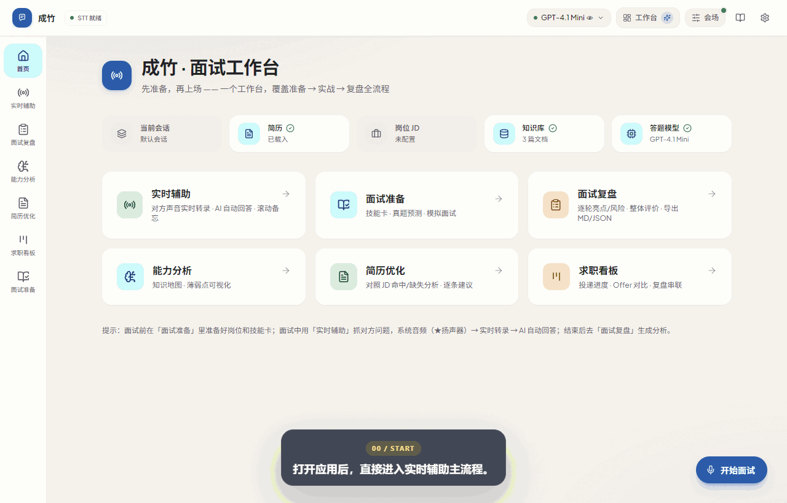
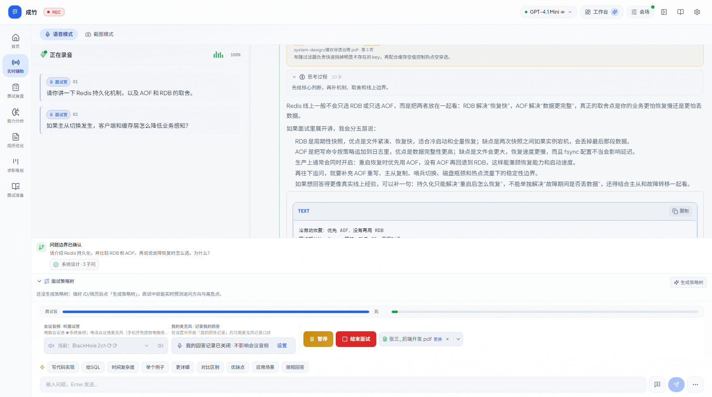
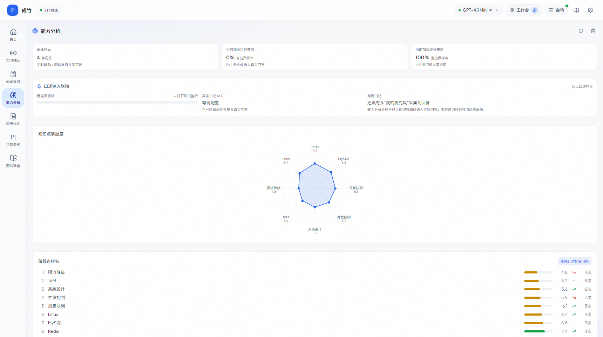
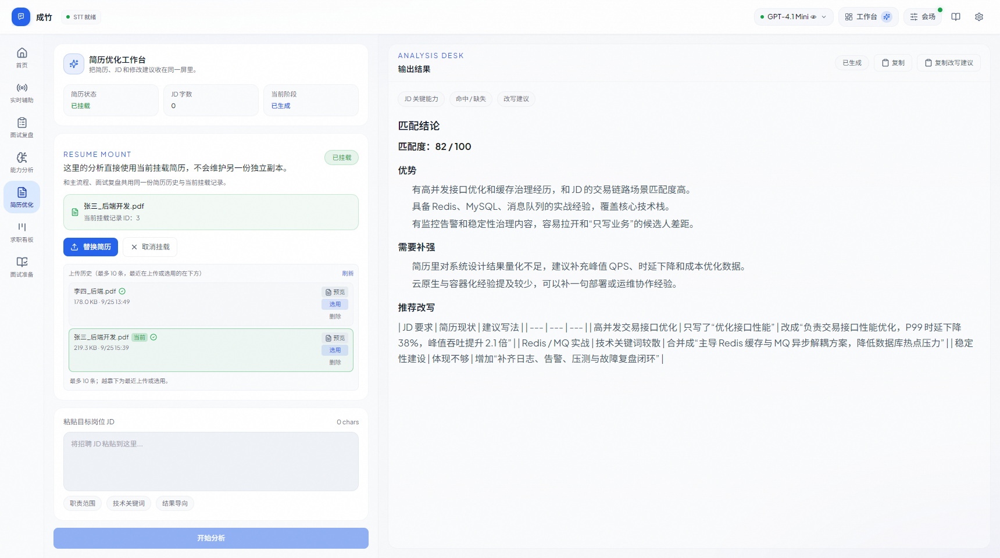
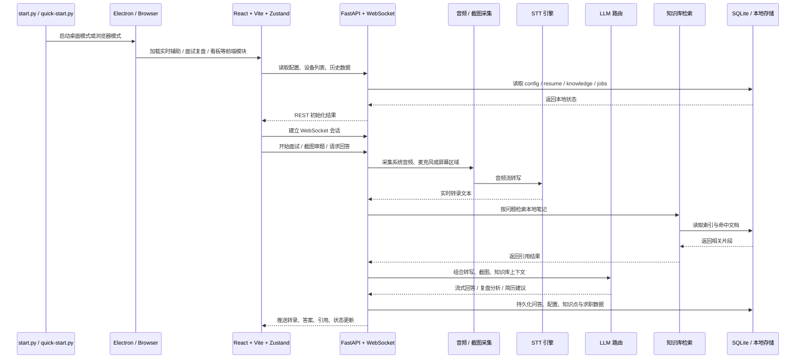

# 成竹 Chengzhu

> **Resume-first, not Resume-bound.** Ready before you speak.

成竹（Chengzhu）是一个从简历启动、但不受简历限制的开放世界实时面试智能体：通过 Candidate Representation 理解候选人的真实经历，通过 Evidence Graph 与 Truth Boundary 保证个人事实不被模型随意改写，通过 Interview State 理解当前面试正在发生什么，通过 Context Compiler 为每一问选择最小充分上下文，通过 Answer Planner 决定以何种结构和深度回答，并利用通用知识与开放世界推理处理个人材料之外的新问题。

> 当前 Canonical：[docs/canonical/Chengzhu_v1.3-R2_CANONICAL.md](docs/canonical/Chengzhu_v1.3-R2_CANONICAL.md)（Current Canonical = v1.3-R2 · Goal-centered Interview OS · 2026-10-01）；Frozen Verified Core = [v1.2-R2](docs/canonical/Chengzhu_v1.2-R2_CANONICAL.md)；Current Stable Release = [v1.3.0](https://github.com/huangdi97/cheng-zhu/releases/tag/v1.3.0)。历史文档（DESIGN.md / PRODUCT.md / v1.0-R1）仅作来源。

v1.3 将成竹组织成一个 **Goal-centered Interview OS**：用户不是在“简历 / 题库 / 实时辅助 / 复盘”几个模块之间来回切换，而是围绕一个具体的公司 × 岗位持续推进。

```text
Goal → Next Focus → Prepare → Practice → Preflight → Live → Reflection → Next Focus
```

当前产品仍然 Interview-first。它把已经验证过的实时核心——系统音频 / 麦克风转写、Fast Cue、Deep Answer、截图上下文、来源与事实边界——放进这条 Goal 循环；同时通过 Fact Inbox、Stories、Quick Notes、Question Banks、Practice 3.0 和 Reflection write-back，让“下一次打开成竹”能够延续上一场真实发生的事情。

长期方向是 Personal Conversation Intelligence，但 Meeting / Presentation / 1:1 等 Conversation Profile 仍属于未来版本，不在当前 v1.3 一级导航里提前产品化。

> v1.4.0 正在做 **Product Validation Hardening**：不新增一级产品，而是把 Goal 复用、Reflection→Next Focus、Fast Cue 有效性、Practice transfer、Fact Inbox burden、Quick Notes / Pin Moment 价值做成 local-first 的可验证闭环。自动化与 synthetic dogfood 只属于工程证据，不能冒充真实用户 PMF。

这是 `huangdi97` 维护和发布的独立项目。产品路线、默认配置、界面文案和后续版本均以成竹为准；项目来源与许可边界见 [NOTICE.md](NOTICE.md)。

<p align="center">
  
  
  
  
  
  
</p>

<p align="center">
  
  <br />
  <sub>演示素材全部来自本仓库的成竹界面；GIF 用于兼容 GitHub 预览，原始视频保留在 <code>docs/screenshots/assist-demo.webm</code>。</sub>
</p>

## 为什么值得试

> 不是“回答生成器”，而是把一个具体求职目标从准备一直带到下一次行动。

| 场景 | v1.3 能力 |
| --- | --- |
| **求职目标** | 一个公司 × 岗位对应一个 Goal Room；Next Focus 根据材料缺口、练习弱点和真实 Session Reflection 持续变化 |
| **我的成竹** | Resume / Project facts / Fact Inbox / Stories / Skills / 表达偏好；个人事实与通用知识严格分源 |
| **准备与资料** | Project Materials、Knowledge Bases、Quick Notes、Question Banks 分角色管理；材料有 Processing / Ready / Failed / Replacing 生命周期 |
| **练习** | Round / Persona / Demeanor / Difficulty / Question Source；支持 adaptive follow-up、2–3 人 Panel、Content Coach × Delivery Coach |
| **上场** | Preflight 冻结本场上下文；Live 默认只突出 Question → Fast Cue → Source/Warning，Deep Answer 为第二层 |
| **会中辅助** | Pin Moment、Quick Notes、受约束的 Nudge / Open Thread、Closing Mode；Human Coach 仅在政策允许的场景工作 |
| **复盘与延续** | Reflection 优先给 Next Step / strengths / improvements / fact checks / story opportunities，并可写回 Goal 的 Next Focus |
| **桌面体验** | Ctrl+K Command Palette、Compact/Standard/Focus Overlay、Light/Dark、390px、键盘与可访问性支持 |

## 面试主流程

1. 选择系统音频或麦克风，点击开始。
2. 左侧实时转写持续落字，系统自动识别“值得回答”的问题。
3. 右侧答案区按当前模型配置流式生成正式回答。
   普通定义题默认短答；“你怎么看/如何评价/怎么设计/如何验证”等开放题会自动切换为深度回答，并在相关时承接上一轮面试官和候选人的上下文。
4. 需要审图时，可粘贴截图，把题目、代码片段或页面内容交给模型分析。
5. 开启知识库后，答案上方会显示引用角标，关联你的本地笔记或资料。
6. 空间紧张时，可用 `⌘⇧J / Ctrl+Shift+J` 折叠左侧实时转录面板，让回答区铺满。
7. 使用桌面模式时，还可以配合 Boss Key 和悬浮提示窗，在本机练习时减少窗口切换。

## 主界面速览

<p align="center">
  
</p>

## 关键能力雷达

<table>
  <tr>
    <td width="50%" valign="top">
      <h3>实时辅助</h3>
      <p>ASR 转写、自动识别问题、流式回答、截图审题、知识库引用、模型健康与 Token 统计。</p>
    </td>
    <td width="50%" valign="top">
      <h3>桌面协同</h3>
      <p>Electron 端提供 Boss Key、托盘、悬浮问答框和快捷键，减少练习过程中的窗口切换。</p>
    </td>
  </tr>
  <tr>
    <td width="50%" valign="top">
      <h3>训练与复盘</h3>
      <p>面试复盘、问答记录、能力分析和薄弱点沉淀，方便把“答过的问题”变成“会讲的话题”。</p>
    </td>
    <td width="50%" valign="top">
      <h3>求职材料</h3>
      <p>简历上传与摘要、JD 对照优化、求职看板、Offer 对比，把面试前后动作收在一个工具里。</p>
    </td>
  </tr>
</table>

## 模块画廊

<table>
  <tr>
    <td width="50%"></td>
    <td width="50%"></td>
  </tr>
  <tr>
    <td align="center"><strong>能力分析</strong><br /><sub>知识点趋势、问答沉淀、薄弱项复盘</sub></td>
    <td align="center"><strong>简历优化</strong><br /><sub>把简历和 JD 放到一起，输出更像“能投出去”的版本</sub></td>
  </tr>
</table>

## 功能总览

| 模块 | 现在能做什么 |
| --- | --- |
| **实时辅助** | ASR 转写 → 问题识别 → 多模型回答 → 截图审题 / 知识库引用 |
| **知识库** | 上传 `.md` / `.txt` / `.log` / `.docx` / `.pdf`，支持检索测试、最近命中和回答引用 |
| **面试复盘** | 录制真实问答、ASR 纠错、逐题分析、整场总结 |
| **能力分析** | 知识点标签、历史问答记录、薄弱点趋势 |
| **简历优化** | 上传简历，对照 JD 给出优化建议和改写方向 |
| **求职看板** | 表格 / Kanban、状态标签、拖拽排序、Offer 对比 |
| **设置中心** | 模型管理、STT 引擎、主题、偏好、快捷键、截图区域等配置 |

## 技术结构



### 技术栈

| 层 | 技术 |
| --- | --- |
| **前端** | React 18 · TypeScript · Vite · Zustand · Tailwind CSS · Playwright |
| **后端** | Python 3.10+ · FastAPI · Uvicorn · WebSocket |
| **语音识别** | faster-whisper · 豆包 (Volcengine) · 通用 ASR (OpenAI-compatible) |
| **LLM** | OpenAI 兼容接口 · 多模型并行 · Think 推理 · 识图 |
| **存储** | SQLite · 本地简历历史 · 知识库索引 |
| **桌面** | Electron |

## 快速开始

### 下载安装（推荐，Windows 10/11 x64）

到 [GitHub Releases](https://github.com/huangdi97/cheng-zhu/releases) 下载：

- `Chengzhu-Setup-x64.exe`：安装版（按用户安装，无需管理员）
- `Chengzhu-Portable-x64.zip`：解压即用

不需要安装 Python、Node.js 或 pip。首次打开会有 11 步引导：本地数据 → 模型 → 语音识别 → 麦克风 / 系统音频 → 共享隐私（默认关闭）→ 简历 → 第一个 Goal → Guided First Practice → 完成。第一次演练会实际走过 Practice 问题、Fast Cue、自己的回答以及 Content / Delivery feedback；无法使用硬件或 provider 时 fallback 会明确标注，不会冒充真实 runtime evidence。所有数据保存在 `%APPDATA%\Chengzhu`。安装包暂未代码签名，首次运行时 Windows SmartScreen 可能提示，选择「仍要运行」即可；请核对 Release 中的 `SHA256SUMS.txt`。

### 从源码运行

#### 1. 准备环境

- Python `3.10+`
- Node.js `22.12+`（桌面模式所需；纯浏览器模式在已有构建产物时可不启动 Node）

### 2. 安装依赖

```bash
git clone https://github.com/huangdi97/cheng-zhu.git
cd cheng-zhu

pip install -r backend/requirements.txt

cd frontend
npm ci
npm run build
cd ..

cp backend/config.example.json backend/config.json
```

### 3. 配置模型

- 编辑 `backend/config.json`
- 填入你要使用的模型 API Key / Base URL / 模型名
- 如果要启用识图、知识库、豆包语音识别，也在这里一并配置

参考文档：

- [配置说明](docs/配置说明.md)
- [API 密钥与模型](docs/API密钥与模型.md)
- [音频配置](docs/音频配置.md)
- [豆包语音识别](docs/豆包语音识别.md)

### 4. 启动应用

```bash
python start.py                 # 桌面模式（推荐）
python start.py --mode network  # 浏览器模式，默认 http://localhost:18080
```

补充说明：

- Windows 双击启动建议使用根目录的 `启动.bat`；它会使用 PATH 中的 `python`。
  如果在命令行运行 `python start.py`，请确认当前 Python 环境已安装项目依赖，
  否则可能出现“后端能启动、简历/PDF/知识库上传时才报缺包”的情况。
- 首次启动如果前端尚未构建，`start.py` 会自动安装并构建前端，因此本机仍需要 Node.js。
- 前端和 Electron 有 `package-lock.json` 时，首次补装会使用 `npm ci`，保证和锁文件一致。
- `python quick-start.py` 适合已经构建过前端、想快速打开桌面模式的场景。
- 只想在浏览器里体验时，可直接用 `--mode network`。

## 开发与自测

```bash
cd frontend && npm run dev
cd backend && python -m uvicorn main:app --host 127.0.0.1 --port 18080 --reload

cd frontend && npm test
python -m pytest backend/tests -q
```

开发模式提示：本地直接跑后端时默认不启用鉴权，`npm run dev` 的 Vite 代理可以直接访问
`http://localhost:18080`。只有 `python start.py --mode network`、`IA_AUTH_ENABLE=1`
或设置了 `IA_AUTH_TOKEN` 时，才会要求局域网请求携带 token。

## 文档

canonical（当前最高优先级设计）：[v1.3-R2](docs/canonical/Chengzhu_v1.3-R2_CANONICAL.md)；冻结核心：[v1.2-R2](docs/canonical/Chengzhu_v1.2-R2_CANONICAL.md)（v1.0-R1 仅作历史来源）；开发 / 发布 / 排障：[DEVELOPMENT](docs/DEVELOPMENT.md) · [RELEASE](docs/RELEASE.md) · [TROUBLESHOOTING](docs/TROUBLESHOOTING.md)；架构与专题文档：

| 分类 | 文档 |
| --- | --- |
| 架构 | [Intelligence Core](docs/architecture/INTELLIGENCE_CORE.md) · [Candidate Representation](docs/architecture/CANDIDATE_REPRESENTATION.md) · [Truth Boundary](docs/architecture/TRUTH_BOUNDARY.md) · [Interview State](docs/architecture/INTERVIEW_STATE.md) · [Context Compiler](docs/architecture/CONTEXT_COMPILER.md) · [Answer Planner](docs/architecture/ANSWER_PLANNER.md) · [Memory](docs/architecture/MEMORY.md) · [Realtime Pipeline](docs/architecture/REALTIME_PIPELINE.md) |
| 产品 | [Live UX](docs/product/LIVE_UX.md) · [Prepare / Mock / Review](docs/product/PREP_MOCK_REVIEW.md) |
| 评测 | [Eval Protocol](docs/evals/EVAL_PROTOCOL.md) |
| 隐私 | [Privacy 与 Policy](docs/privacy/PRIVACY_AND_POLICY.md) |
## README 素材更新

```bash
cd frontend
npx playwright install chromium   # 首次执行需要
npm run screenshots:readme
npm run demo:readme
```

生成结果会输出到 `docs/screenshots/`：

- `assist-demo.webm`：主流程原始视频素材
- `assist-demo-poster.png`：视频封面
- `assist-demo.gif`：README 顶部实际使用的 GIF 演示
- `assist-mode.png`：实时辅助界面
- `knowledge-map.png`：能力分析
- `resume-optimizer.png`：简历优化

更多说明见 [docs/screenshots/README.md](docs/screenshots/README.md)。

## 项目结构

```text
cheng-zhu/
├── start.py
├── quick-start.py
├── backend/
│   ├── main.py
│   ├── api/
│   ├── core/
│   ├── services/
│   └── tests/
├── frontend/
│   ├── src/
│   ├── scripts/
│   └── package.json
├── desktop/
└── docs/
```

## 常见问题

- **Node / npm 报错**：桌面模式请确认 Node.js 版本为 `22.12+`；纯浏览器模式在已有 `frontend/dist` 时可以不启动 Node。
- **Electron 下载慢**：可先设置 `ELECTRON_MIRROR=https://npmmirror.com/mirrors/electron/`，再进入 `desktop/` 执行 `npm install`。
- **macOS 下 sounddevice 安装失败**：先执行 `brew install portaudio`。
- **Whisper 模型下载慢**：可设置 `export HF_ENDPOINT=https://hf-mirror.com`。
- **端口冲突**：可改用 `python start.py --port 9090`。

## 开源协议与免责

- **协议**：[MIT](LICENSE)（自 v1.2.0 起；第三方依赖与资源保留各自许可证，见 [THIRD_PARTY_NOTICES.md](THIRD_PARTY_NOTICES.md)）
- **免责**：项目仅供学习研究，请勿用于学术不端、违规考试或其他不合规场景；使用后果自行承担。

## 反馈与贡献

欢迎通过 GitHub Issue 反馈问题、提出功能建议或提交改进。请不要在 Issue、日志或截图中上传 API Key、简历原件和真实面试录音。
