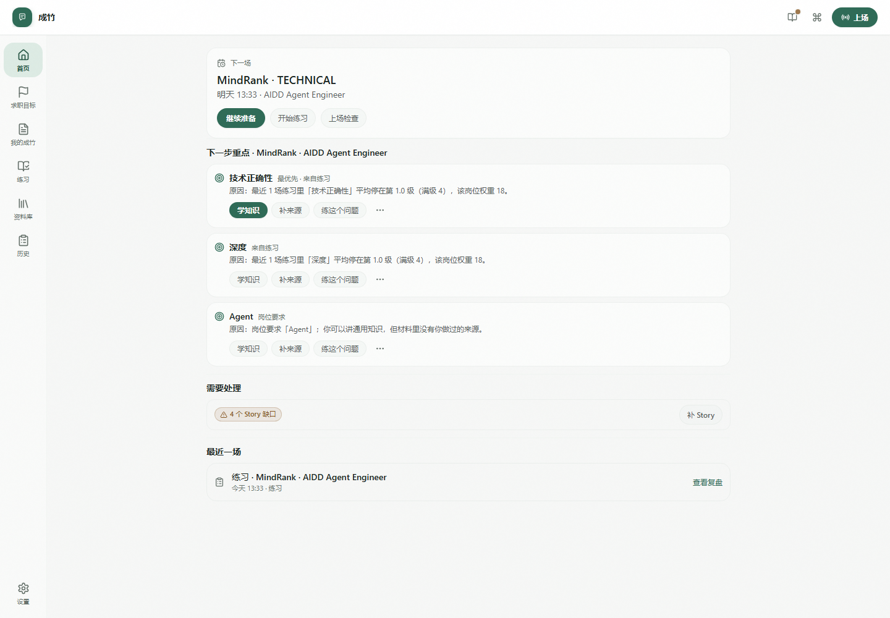
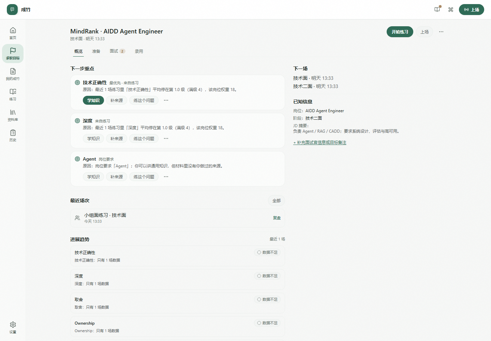
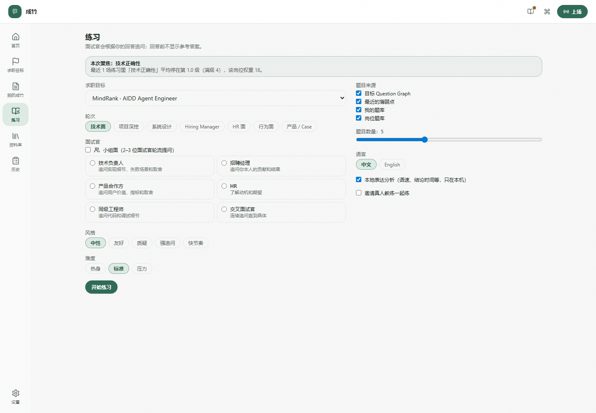
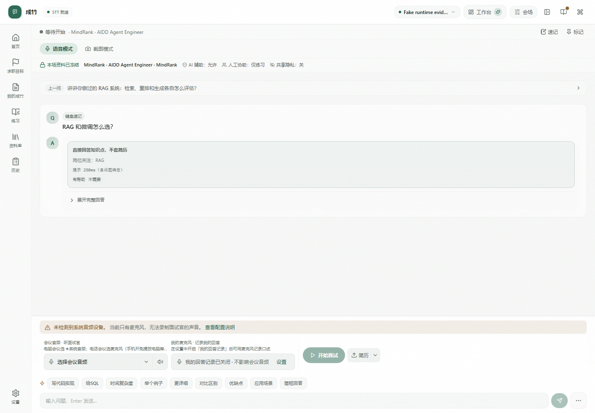
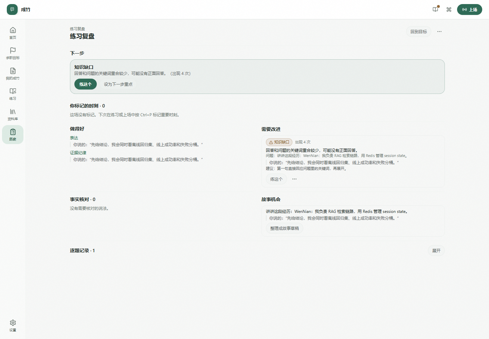
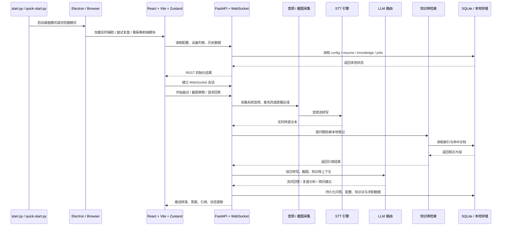

# 成竹 Chengzhu

> **Resume-first, not Resume-bound.** Ready before you speak.

成竹（Chengzhu）是一个从简历启动、但不受简历限制的开放世界实时面试智能体：通过 Candidate Representation 理解候选人的真实经历，通过 Evidence Graph 与 Truth Boundary 保证个人事实不被模型随意改写，通过 Interview State 理解当前面试正在发生什么，通过 Context Compiler 为每一问选择最小充分上下文，通过 Answer Planner 决定以何种结构和深度回答，并利用通用知识与开放世界推理处理个人材料之外的新问题。

> **当前稳定发布产品**：[v1.3-R2 Goal-centered Interview OS](docs/canonical/Chengzhu_v1.3-R2_CANONICAL.md) + [v1.4-R1 Product Validation Hardening](docs/canonical/Chengzhu_v1.4-R1_VALIDATION_HARDENING.md)；Frozen Verified Core = [v1.2-R2](docs/canonical/Chengzhu_v1.2-R2_CANONICAL.md)；Current Stable Release = [GitHub Latest](https://github.com/huangdi97/cheng-zhu/releases/latest) **v1.4.2**。**v2.0-R1 Personal Conversation Intelligence** 已完成 design/runtime closure，并已有 Windows packaged Conversation Beta engineering evidence；当前源码版本进入 **v2.0.0-beta.1 prerelease candidate**。Beta 使用与 stable 相同的 exact-SHA、clean-install、SHA256、download-back 与 provenance gate，但必须以 GitHub **Prerelease** 发布且不得替换 Stable Latest。**尚未声明 stable v2，也没有真实用户/PMF 证据**。完整设计见 [v2.0-R1 Canonical](docs/canonical/Chengzhu_v2.0-R1_PERSONAL_CONVERSATION_INTELLIGENCE.md)，实现闭环见 [Design → Runtime Closure Matrix](docs/canonical/Chengzhu_v2.0-R1_DESIGN_RUNTIME_CLOSURE_MATRIX.md)，发布边界见 [Implementation Master Goal](docs/canonical/Chengzhu_v2.0-R1_IMPLEMENTATION_MASTER_GOAL.md)。

v1.3 将成竹组织成一个 **Goal-centered Interview OS**：用户不是在“简历 / 题库 / 实时辅助 / 复盘”几个模块之间来回切换，而是围绕一个具体的公司 × 岗位持续推进。

```text
Goal → Next Focus → Prepare → Practice → Preflight → Live → Reflection → Next Focus
```

当前产品仍然 Interview-first。它把已经验证过的实时核心——系统音频 / 麦克风转写、Fast Cue、Deep Answer、截图上下文、来源与事实边界——放进这条 Goal 循环；同时通过 Fact Inbox、Stories、Quick Notes、Question Banks、Practice 3.0 和 Reflection write-back，让“下一次打开成竹”能够延续上一场真实发生的事情。

v2 方向已经正式收敛为 **Personal Conversation Intelligence**：一个 Core 下保留 Interview Profile，并新增 Conversation Profile。Project Sync / Design Review 是首发验证楔子，Presentation / Q&A、1:1、Client Call、Negotiation 作为共享 runtime 的 Profile Template；它们不会变成六个一级导航。v2 的核心差异不是“会议纪要”或“有一张实时提示卡”，而是 **Contribution Opportunity + Provenance-aware Continuity + Stakeholder-aware Expression + Silence / Interruption Control**。Conversation Beta 已从源码 runtime 推进到 packaged engineering candidate；`v2.0.0-beta.1` 只表示可安装、可审计、可回滚的公开测试通道，不等于 stable v2，也不等于真实用户价值已验证。 六个模板也已经不只是 label/default mode 不同：它们具有各自的 frozen Profile Playbook，并贯穿 Template Picker → Prepare → Pack → Live → Continue；但这仍不等于 profile-specific real-user validation。

> v1.4 已完成 **Product Validation Hardening** 的工程闭环：Goal 复用、Reflection→Next Focus、Fast Cue 有效性、Practice transfer、Fact Inbox burden、Quick Notes / Pin Moment 价值都进入 local-first 可验证链路；7-day / 30-session / 100-session synthetic continuity 与 packaged release gate 已落地。自动化和 synthetic dogfood 仍然只是工程证据，`REAL_USER_EVIDENCE_PENDING` 不变。

这是 `huangdi97` 维护和发布的独立项目。产品路线、默认配置、界面文案和后续版本均以成竹为准；项目来源与许可边界见 [NOTICE.md](NOTICE.md)。

<p align="center">
  
  
  
  
  
  
</p>

<p align="center">
  
  <br />
  <sub>截图来自 v1.4.2 正式 Windows packaged release 的 runtime evidence。当前产品从 Goal 开始，而不是从“打开实时辅助”开始。</sub>
</p>

<table>
  <tr>
    <td width="50%"></td>
    <td width="50%"></td>
  </tr>
  <tr>
    <td align="center"><sub>Goal Room · Next Focus / 下一场 / 进展趋势</sub></td>
    <td align="center"><sub>Practice 3.0 · Persona / Difficulty / Question Source</sub></td>
  </tr>
  <tr>
    <td width="50%"></td>
    <td width="50%"></td>
  </tr>
  <tr>
    <td align="center"><sub>Live · 当前问题与 Fast Cue 保持视觉权威</sub></td>
    <td align="center"><sub>Reflection · 下一步 / Pin / 待确认事实 / Story 机会</sub></td>
  </tr>
</table>

## 为什么值得试

> 不是“回答生成器”，而是把一个具体求职目标从准备一直带到下一次行动。

| 场景 | v1.3 能力 |
| --- | --- |
| **求职目标** | 一个公司 × 岗位对应一个 Goal Room；Next Focus 根据材料缺口、练习弱点和真实 Session Reflection 持续变化 |
| **我的成竹** | Resume / Project facts / Fact Inbox / Stories / Skills / 表达偏好；个人事实与通用知识严格分源 |
| **准备与资料** | Project Materials、Knowledge Bases、Quick Notes、Question Banks 分角色管理；材料有 Processing / Ready / Failed / Replacing 生命周期 |
| **练习** | Round / Persona / Demeanor / Difficulty / Question Source；支持 adaptive follow-up、2–3 人 Panel、Content Coach × Delivery Coach |
| **上场** | Preflight 冻结本场上下文；Live 默认只突出 Question → Fast Cue → Source/Warning，Deep Answer 为第二层 |
| **会中辅助** | Pin Moment、Quick Notes、受约束的 Nudge / Open Thread、Closing Mode；Human Coach 仅在政策允许的场景工作 |
| **复盘与延续** | Reflection 优先给 Next Step / strengths / improvements / fact checks / story opportunities，并可写回 Goal 的 Next Focus |
| **桌面体验** | Ctrl+K Command Palette、Compact/Standard/Focus Overlay、Light/Dark、390px、键盘与可访问性支持 |

## 产品主流程

成竹现在不是从「打开实时辅助」开始，而是从一个具体的公司 × 岗位 Goal 开始：

1. **创建求职目标**：保存公司、岗位、JD、轮次和下一场时间。
2. **看下一步重点**：Goal Room 根据材料缺口、练习弱点、事实边界和上一场 Reflection 给出 1–3 个可执行动作，不生成虚假“准备度”。
3. **准备**：整理 Stories / Skills、项目材料、知识库、Quick Notes 与 Question Banks；只有 Ready 材料才能进入本场上下文。
4. **练习**：选择轮次、面试官风格、难度和题目来源；支持 adaptive follow-up、Panel、多维 Content / Delivery feedback。
5. **上场检查**：Preflight 明确本场继承了哪些 Resume / Stories / Skills / Knowledge / Quick Notes，以及 AI / Human / Share Privacy policy。
6. **Live**：默认优先显示当前 Question → Fast Cue → Source / Warning；完整回答、历史轮次、转录和辅助工具降到第二层。
7. **复盘**：优先展示下一步、做得好的、需要改进、待确认事实、Story 机会和用户自己标记的 Pin；动作可以真实写回 Next Focus。
8. **继续同一个 Goal**：下一次打开成竹时，从上一次真实发生的事情继续，而不是重新从模块首页找入口。

## 当前产品地图

| 区域 | 用户任务 | 当前能力 |
| --- | --- | --- |
| **首页** | 我下一步该做什么 | 下一场、下一步重点、待处理事项、最近 Session |
| **求职目标** | 拿下一个具体公司 × 岗位 | Goal Room · Prepare · Interviews · Offer · Progress Trends |
| **我的成竹** | 管理“我是谁”和哪些话能安全说 | Resume · Projects · Fact Inbox · Stories · Skills · Expression |
| **练习** | 有针对性地练薄弱点 | Round / Persona / Demeanor / Difficulty / Sources · Panel · Adaptive Follow-up |
| **资料库** | 管理不同角色的材料 | Project Materials · Knowledge Bases · Quick Notes · Question Banks |
| **上场** | 在正式 Session 中获得低干扰辅助 | Preflight · Fast Cue · Deep · Pin · Nudge · Closing · Overlay |
| **历史 / 复盘** | 把这场变成下一次行动 | Session History · Reflection · Next Focus write-back |
| **设置 / 诊断** | 控制模型、语言、隐私和本地证据 | 五层语言 · Overlay · Privacy · Export/Delete · v1.4 local validation |

### Conversation Beta（v2 runtime，非 stable release）

Conversation Profile 当前已经有一条真实 additive runtime：

```text
Conversation Home
→ Space
→ Prepare
→ Preflight
→ Frozen Session Pack
→ Participate
→ Continue
→ same Space
```

已经存在：
- Profile-aware Conversation Home / Spaces / History；
- Project Sync / Design Review 等共享模板；
- source-aware Manual Ask 与 cross-session Recall；
- Conversation Goal lifecycle（active / resolved / reopen）与 frozen session membership；
- Conversation Item truth/review model、atomic Decision supersession 与 reviewed longitudinal Open Threads；
- Contribution Opportunity + Guidance Arbiter + SILENT；
- explicit Counterparty State 与 stakeholder-aware expression；
- 6 个 Conversation Profile 的 frozen Playbook：success conditions / priority truth types / Prepare prompts / closing objective / boundaries；
- Participant consent status + transparency plan（均为用户报告，不声称系统自动通知）；
- Session Pack 冻结来源、Quick Notes、confirmed items、Goals、participants、我的表达、policy 与 resolved processing data path；
- Conversation-owned TRANSCRIPT capture；
- grounded global Decision / Commitment / Open Question search + Ctrl+K entry；
- categorized current Session / Space local export；
- schema v6 temporal provenance：original text / normalized datetime / timezone / ambiguity；
- schema v7 Conversation Screen Context：MANUAL 单次显式抓取 + AUTO Live 二次显式启动；AUTO 支持 ACTIVE / OFF THE RECORD / stop、同帧去重、限频与错误 fail-stop；原图不落库，只保留提取文本 + image hash + vision route/model provenance；
- subsystem-level Conversation Diagnostics；
- retention / export / deletion provenance；
- reviewed local DraftActions。

当前能力边界：
- Conversation MANUAL + explicit-start AUTO Screen Context 已实现；AUTO 不随 Session 静默启动，并要求用户报告 consent/allowance + transparency plan；
- Conversation `PRIVATE_OVERLAY` 已有桌面 runtime：Start 时验证 Electron content protection，Live 可见，End 恢复会话前默认；Web fallback fail-closed；best-effort only，不承诺“不可检测”；
- Conversation Human Coach 仍未接线；
- Calendar / Docs / Mail / project tracker connector runtime；
- actual external email/task/issue write-back；
- v2 packaged stable release；
- real-user / PMF evidence。

这些能力在真实接线前会 fail-closed 或显式标为 unavailable，而不是保留“能选但不生效”的开关。

研究与完整边界：
- [v2 Competitive Research · 2026-10-06](docs/research/Chengzhu_v2.0_Conversation_Competitive_Research_2026-10-06.md)
- [v2 Implementation & Rollout Master Goal](docs/canonical/Chengzhu_v2.0-R1_IMPLEMENTATION_MASTER_GOAL.md)

### 当前 Live 层级

```text
第一层：Question
       ↓
       Fast Cue
       ↓
       Source / Warning

第二层：Deep Answer · Transcript · Quick Notes · Screen · References · Coach
```

历史轮次默认折叠，新的实时问题和 Cue 保持视觉权威。共享隐私默认关闭；它只是受支持窗口路径上的内容保护，不是“不可检测”承诺。

### 当前验证边界

v1.4 的本地产品分析回答六个问题：

```text
Goal 是否持续复用？
Reflection 是否改变下一步？
Fast Cue 是否真的有帮助？
Practice 是否带来后续改善？
Fact Inbox 是否成为负担？
Quick Notes / Pin 是否真的创造价值？
```

这些信号默认只保存在本机。自动化、synthetic dogfood 和 mock-to-mock transfer 只能证明工程闭环，不能冒充真实用户 PMF 或真实面试提升。

## 技术结构



### 技术栈

| 层 | 技术 |
| --- | --- |
| **前端** | React 18 · TypeScript · Vite · Zustand · Tailwind CSS · Playwright |
| **后端** | Python 3.10+ · FastAPI · Uvicorn · WebSocket |
| **语音识别** | faster-whisper · 豆包 (Volcengine) · 通用 ASR (OpenAI-compatible) |
| **LLM** | OpenAI 兼容接口 · 多模型并行 · Think 推理 · 识图 |
| **存储** | SQLite · 本地简历历史 · 知识库索引 |
| **桌面** | Electron |

## 快速开始

### 下载安装（推荐，Windows 10/11 x64）

到 [GitHub Releases](https://github.com/huangdi97/cheng-zhu/releases) 下载：

- `Chengzhu-Setup-x64.exe`：安装版（按用户安装，无需管理员）
- `Chengzhu-Portable-x64.zip`：解压即用

不需要安装 Python、Node.js 或 pip。首次打开会有 11 步引导：本地数据 → 模型 → 语音识别 → 麦克风 / 系统音频 → 共享隐私（默认关闭）→ 简历 → 第一个 Goal → Guided First Practice → 完成。第一次演练会实际走过 Practice 问题、Fast Cue、自己的回答以及 Content / Delivery feedback；无法使用硬件或 provider 时 fallback 会明确标注，不会冒充真实 runtime evidence。所有数据保存在 `%APPDATA%\Chengzhu`。安装包暂未代码签名，首次运行时 Windows SmartScreen 可能提示，选择「仍要运行」即可；请核对 Release 中的 `SHA256SUMS.txt`。

### 从源码运行

#### 1. 准备环境

- Python `3.10+`
- Node.js `22.12+`（桌面模式所需；纯浏览器模式在已有构建产物时可不启动 Node）

### 2. 安装依赖

```bash
git clone https://github.com/huangdi97/cheng-zhu.git
cd cheng-zhu

pip install -r backend/requirements.txt

cd frontend
npm ci
npm run build
cd ..

cp backend/config.example.json backend/config.json
```

### 3. 配置模型

- 编辑 `backend/config.json`
- 填入你要使用的模型 API Key / Base URL / 模型名
- 如果要启用识图、知识库、豆包语音识别，也在这里一并配置

参考文档：

- [配置说明](docs/配置说明.md)
- [API 密钥与模型](docs/API密钥与模型.md)
- [音频配置](docs/音频配置.md)
- [豆包语音识别](docs/豆包语音识别.md)

### 4. 启动应用

```bash
python start.py                 # 桌面模式（推荐）
python start.py --mode network  # 浏览器模式，默认 http://localhost:18080
```

补充说明：

- Windows 双击启动建议使用根目录的 `启动.bat`；它会使用 PATH 中的 `python`。
  如果在命令行运行 `python start.py`，请确认当前 Python 环境已安装项目依赖，
  否则可能出现“后端能启动、简历/PDF/知识库上传时才报缺包”的情况。
- 首次启动如果前端尚未构建，`start.py` 会自动安装并构建前端，因此本机仍需要 Node.js。
- 前端和 Electron 有 `package-lock.json` 时，首次补装会使用 `npm ci`，保证和锁文件一致。
- `python quick-start.py` 适合已经构建过前端、想快速打开桌面模式的场景。
- 只想在浏览器里体验时，可直接用 `--mode network`。

## 开发与自测

```bash
cd frontend && npm run dev
cd backend && python -m uvicorn main:app --host 127.0.0.1 --port 18080 --reload

cd frontend && npm test
python -m pytest backend/tests -q
```

开发模式提示：本地直接跑后端时默认不启用鉴权，`npm run dev` 的 Vite 代理可以直接访问
`http://localhost:18080`。只有 `python start.py --mode network`、`IA_AUTH_ENABLE=1`
或设置了 `IA_AUTH_TOKEN` 时，才会要求局域网请求携带 token。

### Conversation Beta 人工评测（仅本地）

工程通过不代表真实用户价值。对于自行授权的真实或内部试用会话，可先在**本机**导出未标注复核队列，再由评审者填写标签：

```bash
python scripts/v2_conversation_label_seed.py --db /path/to/product.db --out ./local-review-seed.jsonl
python scripts/v2_conversation_human_eval.py ./reviewed-labels.jsonl --out ./local-eval.json
```

模板与说明见 [Conversation Human-label Evaluation Protocol](docs/evals/V2_CONVERSATION_HUMAN_LABEL_PROTOCOL.md)。原始标签可能含私人会议事实，请勿上传到公开仓库或 CI。缺少标签的指标保持 N/A；有人工标签也**不自动代表**真实外部用户验证、稳定发布或 PMF。

## 文档

canonical：Interview 当前稳定产品以 [v1.3-R2](docs/canonical/Chengzhu_v1.3-R2_CANONICAL.md) / [v1.4-R1](docs/canonical/Chengzhu_v1.4-R1_VALIDATION_HARDENING.md) 为准；Conversation v2 以 [v2.0-R1 Personal Conversation Intelligence](docs/canonical/Chengzhu_v2.0-R1_PERSONAL_CONVERSATION_INTELLIGENCE.md) + [Implementation Master Goal](docs/canonical/Chengzhu_v2.0-R1_IMPLEMENTATION_MASTER_GOAL.md) + [Design → Runtime Closure Matrix](docs/canonical/Chengzhu_v2.0-R1_DESIGN_RUNTIME_CLOSURE_MATRIX.md) 为准；冻结核心：[v1.2-R2](docs/canonical/Chengzhu_v1.2-R2_CANONICAL.md)（v1.0-R1 仅作历史来源）；开发 / 发布 / 排障：[DEVELOPMENT](docs/DEVELOPMENT.md) · [RELEASE](docs/RELEASE.md) · [TROUBLESHOOTING](docs/TROUBLESHOOTING.md)；架构与专题文档：

| 分类 | 文档 |
| --- | --- |
| 架构 | [Intelligence Core](docs/architecture/INTELLIGENCE_CORE.md) · [Candidate Representation](docs/architecture/CANDIDATE_REPRESENTATION.md) · [Truth Boundary](docs/architecture/TRUTH_BOUNDARY.md) · [Interview State](docs/architecture/INTERVIEW_STATE.md) · [Context Compiler](docs/architecture/CONTEXT_COMPILER.md) · [Answer Planner](docs/architecture/ANSWER_PLANNER.md) · [Memory](docs/architecture/MEMORY.md) · [Realtime Pipeline](docs/architecture/REALTIME_PIPELINE.md) |
| 产品 | [Live UX](docs/product/LIVE_UX.md) · [Prepare / Mock / Review](docs/product/PREP_MOCK_REVIEW.md) |
| 评测 | [Eval Protocol](docs/evals/EVAL_PROTOCOL.md) |
| 隐私 | [Privacy 与 Policy](docs/privacy/PRIVACY_AND_POLICY.md) |
## README 素材更新

README 主视觉必须和当前 Goal-centered 产品一致。当前公开截图来自 v1.4.2 正式 packaged runtime evidence：

- `action-home.png`
- `goal-room.png`
- `practice.png`
- `preflight.png`
- `live-fast-cue.png`
- `reflection.png`
- `command-palette.png`
- `goal-prepare-390.png`

旧 `assist-demo.* / assist-mode.png / knowledge-map.png / resume-optimizer.png` 只作为历史素材保留，不再代表当前主产品。

自动生成脚本后续也必须遵循：

```text
Action Home
→ Goal Room
→ Practice
→ Preflight
→ Live Fast Cue
→ Reflection
→ Next Focus
```

更多说明见 [docs/screenshots/README.md](docs/screenshots/README.md)。

## 项目结构

```text
cheng-zhu/
├── start.py
├── quick-start.py
├── backend/
│   ├── main.py
│   ├── api/
│   ├── core/
│   ├── services/
│   └── tests/
├── frontend/
│   ├── src/
│   ├── scripts/
│   └── package.json
├── desktop/
└── docs/
```

## 常见问题

- **Node / npm 报错**：桌面模式请确认 Node.js 版本为 `22.12+`；纯浏览器模式在已有 `frontend/dist` 时可以不启动 Node。
- **Electron 下载慢**：可先设置 `ELECTRON_MIRROR=https://npmmirror.com/mirrors/electron/`，再进入 `desktop/` 执行 `npm install`。
- **macOS 下 sounddevice 安装失败**：先执行 `brew install portaudio`。
- **Whisper 模型下载慢**：可设置 `export HF_ENDPOINT=https://hf-mirror.com`。
- **端口冲突**：可改用 `python start.py --port 9090`。

## 开源协议与免责

- **协议**：[MIT](LICENSE)（自 v1.2.0 起；第三方依赖与资源保留各自许可证，见 [THIRD_PARTY_NOTICES.md](THIRD_PARTY_NOTICES.md)）
- **免责**：项目仅供学习研究，请勿用于学术不端、违规考试或其他不合规场景；使用后果自行承担。

## 反馈与贡献

欢迎通过 GitHub Issue 反馈问题、提出功能建议或提交改进。请不要在 Issue、日志或截图中上传 API Key、简历原件和真实面试录音。
